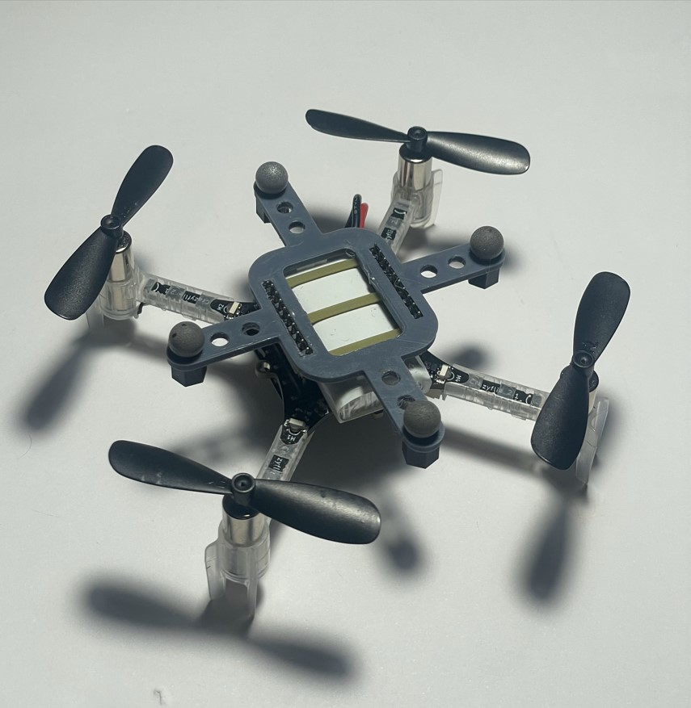
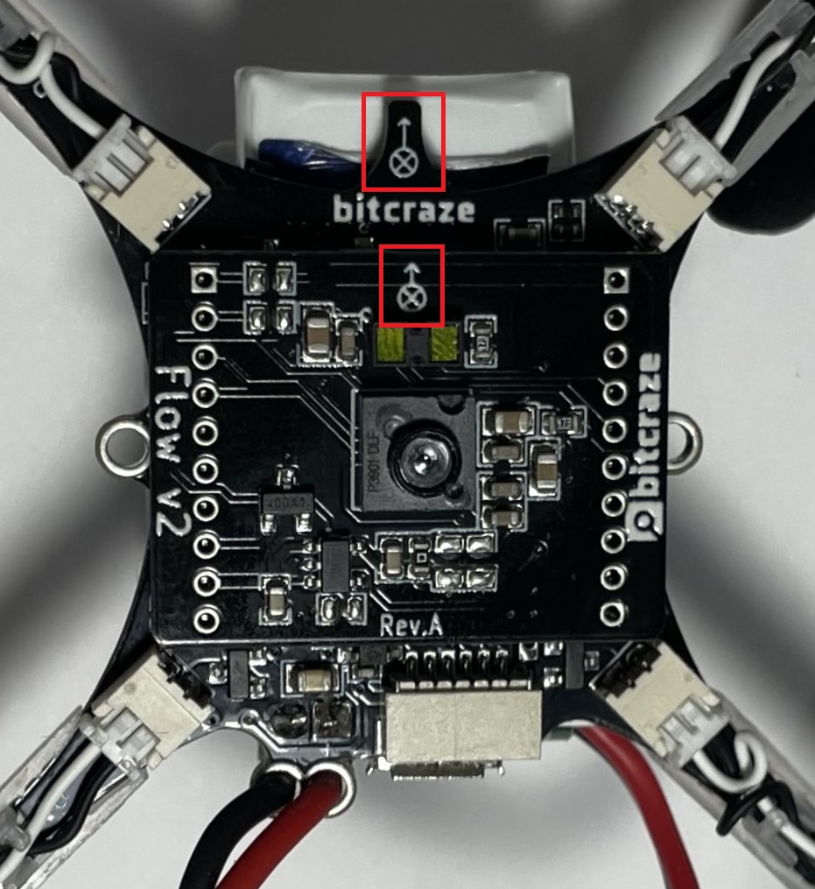
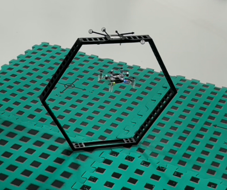

# Herramientas de software para el control individual y seguro del cuadricópetro Crazyflie 2.1
_Este repositorio contiene el desarrollo de herramientas de software y documentación relacionada con el proyecto de control individual y seguro del cuadricóptero Crazyflie 2.1 utilizando la placa de expansión de posicionamiento Flow Deck. El objetivo es facilitar el uso independiente de este microdron en entornos educativos y de investigación en la Universidad del Valle de Guatemala. Este repositorio centraliza todos los recursos necesarios para realizar experimentos de control y navegación con el dron Crazyflie, permitiendo a estudiantes e investigadores utilizar y mejorar este sistema de manera accesible y segura._

<p align="center">
  
  
  
</p>

## Descripción
Este proyecto implementa un conjunto de herramientas de software para controlar el dron Crazyflie 2.1 de forma individual, utilizando la placa de expansión Flow Deck para mejorar su precisión de posicionamiento. A lo largo del desarrollo, se probaron y validaron varios algoritmos de control básico en Python, compatibles con Matlab, para permitir la integración entre ambos entornos. Además, se llevaron a cabo experimentos en el ecosistema de investigación Robotat, adaptando el dron a las condiciones y requisitos específicos de las prácticas de laboratorio y de investigación en la Universidad del Valle de Guatemala​.

## Índice
- [Descripción](#descripción)
- [Estructura del proyecto](#estructura-del-repositorio)
- [Requisitos previos](#requisitos-previos)
- [Instalación](#instalación)
- [Uso y ejemplos](#uso-y-ejemplos)
- [Documentación](#documentación)
- [Licencia](#referencias)
- [Referencias](#agradecimientos)

## Estructura del repositorio
- **experimentos**: Conjunto de scripts en Matlab de los experimentos realizados para validar a las herramientas de software desarrolladas .
- **laboratorios**: Conjunto de scripts de los experimentos de los laboratorios, junto a las guías de laboratorio elaboradas.
- **multimedia**: Imágenes y videos que ilustran el proyecto en acción.
- **paquete_de_herramientas**: Herramientas de software y scripts necesarios para controlar al dron Crazyflie.

## Requisitos previos
Para este proyecto, se utilizaron Python y Matlab como herramientas principales para el desarrollo y control del dron Crazyflie:

- **Python 3.11.0**: Usado para desarrollar las funciones de control básico del Crazyflie, utilizando las siguientes librerías:
  - `cflib`: Librería oficial de Crazyflie para comunicación y control del dron.
  - `time`: Para la gestión de temporización.
  - `sys`: Para la manipulación de parámetros del sistema.
  - `event`: Para el manejo de eventos necesarios en el control.
  - `logging`: Para registrar información relevante sobre el funcionamiento del dron y depuración de errores.

- **Matlab '24.1.0.2603908 (R2024a) Update 3'**: Usado como centro de control para ejecutar experimentos más complejos con el dron Crazyflie. Matlab permite invocar funciones de Python mediante comandos específicos, proporcionando una integración eficaz entre ambos lenguajes. Esta versión de Matlab es compatible con Python 3.11.0, según la matriz de compatibilidad oficial de Matlab, asegurando una comunicación fluida y estable entre Matlab y Python.

## Instalación
1. **Instalar Python**: Asegúrate de tener Python 3.11.0 instalado. Puedes verificar tu versión de Python con el siguiente comando:
   ```bash
   python --version
Asegúrate de agregar Python al PATH durante la instalación. 

2. **Instalar cflib**: Esta librería es fundamental para la comunicación con el dron Crazyflie. Para instalarla, ejecuta el siguiente comando:
   ```bash
   pip install cflib
Este comando instalará las dependencias necesarias para el funcionamiento del dron, como pyusb, libusb-package, scipy, numpy, entre otras.

3. **Configurar Python en Matlab**: Si deseas ejecutar funciones de Python desde Matlab, asegúrate de que Matlab reconozca la versión correcta de Python. Para comprobar esto, abre Matlab y ejecuta:
   ```bash
   pyenv
   
4. Si la versión de Python no es la correcta, cambia la configuración ejecutando el siguiente comando, reemplazando 'ruta/a/python' con la ruta a tu instalación de Python:
   ```bash
   pyenv('Version', 'ruta/a/python')
Esto permitirá que Matlab utilice la instalación de Python correcta y acceda a las librerías de Crazyflie.
   
## Uso y ejemplos
Las funciones de control desarrolladas para el dron Crazyflie 2.1 permiten ejecutar tareas de conexión, despegue, aterrizaje, y seguimiento de trayectorias. Estas funciones también habilitan la fusión de datos de sensores del dron y el sistema de captura de movimiento Robotat, proporcionando un control seguro y preciso en diversos experimentos y escenarios de vuelo.

En la carpeta `experimentos` encontrarás ejemplos detallados de uso. Cada archivo en esta carpeta explica el propósito del experimento y contiene instrucciones para ejecutar cada paso. Asegúrate de tener instaladas todas las dependencias de software mencionadas en el manual de usuario incluido en la documentación del proyecto. Esta carpeta contiene todos los experimentos realizados para validar el uso del dron Crazyflie con la placa Flow Deck utilizando las funciones de control desarrolladas. 

**Experimentos:**
- `experimento1.m`: Prueba de conexión y desconexión.
- `experimento2.m`: Prueba de despegue y aterrizaje.
- `experimento3.m`: Prueba de vuelo a través de una trayectoria lineal simple.
- `experimento4.m`: Prueba de vuelo a través de una trayectoria circular.
- `experimento5.m`: Prueba de vuelo a través de una trayectoria lineal con fusión de sensores (Flow Deck + Robotat).
- `experimento6.m`: Prueba de vuelo a través de una trayectoria circular con fusión de sensores (Flow Deck + Robotat).
- `experimento7.m`: Prueba de despegue con modificación en el controlador PID.

Para llevar a cabo estos experimentos dentro del ecosistema Robotat, es necesario asegurar un entorno adecuado que garantice el funcionamiento correcto de la placa de expansión Flow Deck. Como se menciona en el manual de usuario, se recomienda utilizar superficies con patrones reconocibles y diferenciables, disponibles en la carpeta `multimedia/misceláneos` del repositorio. También es fundamental que la iluminación sea adecuada, manteniendo únicamente encendidas las luces periféricas del laboratorio para optimizar las lecturas del sensor de flujo óptico.

## Documentación

## Referencias
- Bitcraze, documentación de Crazyflie y sus módulos.
- Universidad del Valle de Guatemala, guías de laboratorio y experimentos desarrollados.

## Agradecimientos
* Asesor: Msc. Miguel Zea
---
Por [PabloCaal](https://github.com/PabloCaal)
